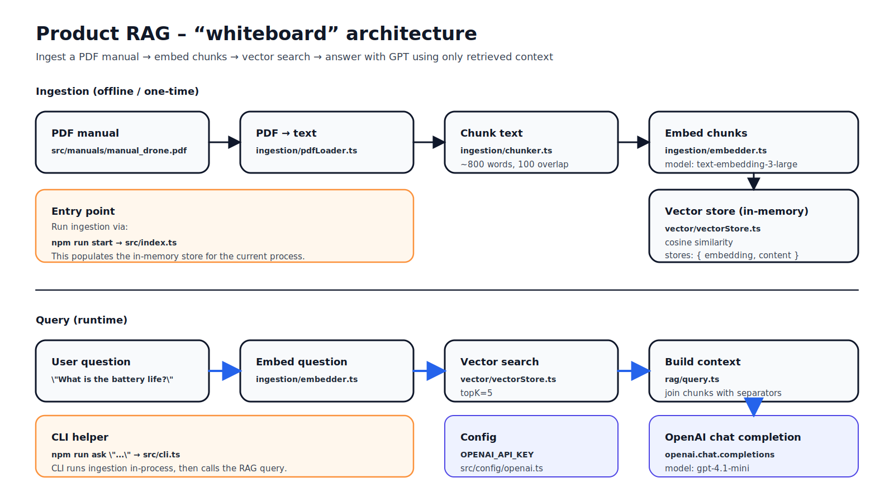

# Product RAG

A Retrieval-Augmented Generation (RAG) system for querying product documentation using OpenAI embeddings and GPT-4.

## Architecture (whiteboard)



If your Markdown renderer blocks SVGs, open it directly: [docs/whiteboard.svg](docs/whiteboard.svg)

## Guardrails

- **Refuse when docs don’t support it**: if retrieval confidence is low, the app returns “I don’t know based on the provided documentation…”
  - Tune with `RAG_MIN_SIMILARITY` (higher = stricter, default is `0.25`)
- **Prompt-injection hardened**: retrieved text is treated as untrusted and never followed as instructions
- **Citations**: answers include which chunk(s) were used

## What is this?

This project demonstrates a simple RAG pipeline that:

1. **Loads** PDF product manuals
2. **Chunks** the text into smaller overlapping segments
3. **Embeds** the chunks using OpenAI's `text-embedding-3-large` model
4. **Stores** the vectors in an in-memory vector store
5. **Queries** the documentation using semantic search + GPT-4 to answer questions

## Project Structure

```
src/
├── config/
│   └── openai.ts         # OpenAI client configuration
├── ingestion/
│   ├── pdfLoader.ts      # PDF text extraction
│   ├── chunker.ts        # Text chunking with overlap
│   └── embedder.ts       # OpenAI embeddings generation
├── vector/
│   └── vectorStore.ts    # In-memory vector store with cosine similarity
├── rag/
│   └── query.ts          # RAG query pipeline
├── manuals/
│   └── manual_drone.pdf  # Sample product manual
├── index.ts              # Ingestion entry point
└── cli.ts                # Interactive CLI for asking questions
```

## Setup

1. **Install dependencies:**

```bash
npm install
```

2. **Set up environment variables:**

Create a `.env` file in the project root:

```env
OPENAI_API_KEY=your_openai_api_key_here
```

## Usage

### Ingest a PDF

Run the ingestion pipeline to process and embed the drone manual:

```bash
npm run start
```

### Ask questions

Query the embedded documentation:

```bash
npm run ask "What is the battery life of the drone?"
```

## Web UI (Vite + React)

The browser UI calls a local API server so your OpenAI key stays on the server.

1. Create `.env` in the repo root:

```env
OPENAI_API_KEY=your_openai_api_key_here
```

2. Run both API + UI:

```bash
npm run dev
```

- **API**: `http://localhost:8787/api/health`
- **Web**: `http://localhost:5173`

Example output:
```
Loading and processing PDF...
Created 22 chunks, generating embeddings...
Querying...

Answer: The DJI Air 2S drone has a maximum flight time of 31 minutes...
```

## How it works

### Chunking
Text is split into overlapping chunks of ~800 words with 100-word overlap to preserve context across chunk boundaries.

### Embedding
Each chunk is embedded using OpenAI's `text-embedding-3-large` model, which produces high-dimensional vectors capturing semantic meaning.

### Vector Search
When a question is asked, it's embedded using the same model, and cosine similarity is used to find the most relevant chunks.

### Answer Generation
The top matching chunks are passed as context to GPT-4, which generates an answer based solely on the provided documentation.

## Tech Stack

- **TypeScript** with ESM modules
- **OpenAI API** for embeddings and chat completions
- **pdf-parse** for PDF text extraction
- **tsx** for running TypeScript directly

## License

ISC
